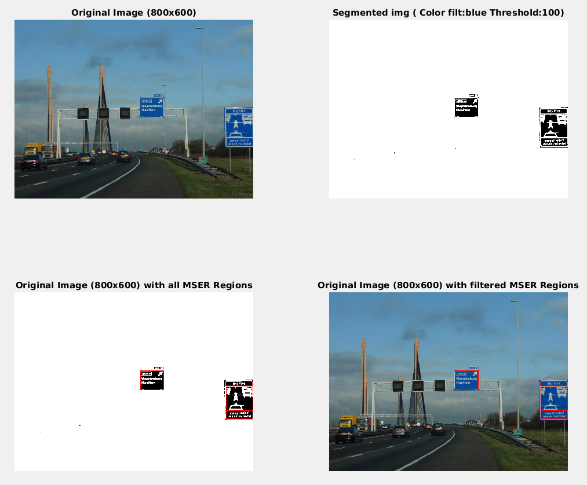

# MSER - LT (Linear timer MSER algorithm)
-------------------------------

**Developer:** Ânderson I. Silva

**Repository:** https://github.com/aignacio/mser

**Objective:** Script in MATLAB to find and segment traffic signs using the Linear-Time MSER algorithm.
